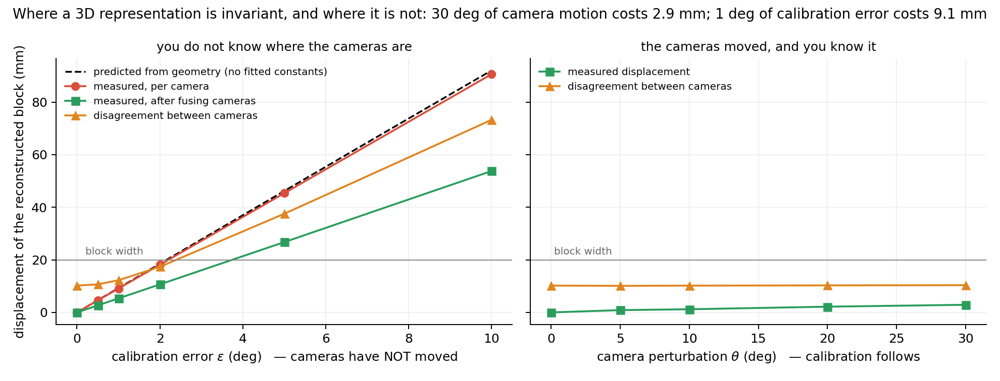
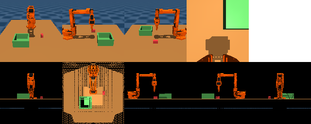

# What does re-rendering actually buy you?

**Separating the three mechanisms inside RVT-style 3D robot policies, and
measuring what each one costs.**

Jitendra Malik, [October 2025](https://x.com/JitendraMalikCV): *"Many robotics
papers in the learning era weren't exploiting 3D structure, which IMHO is just
wasting valuable signal."* He is right, and this repository takes the point
seriously enough to ask the follow-up question: **exploiting 3D structure how,
and at what price?**

[RVT](https://robotic-view-transformer.github.io/) (Goyal et al., CoRL 2023)
unprojects RGBD into a world-frame point cloud and re-renders it from *fixed*
virtual cameras before a transformer ever sees it. It works. The field's
shorthand for why is "it uses 3D structure" — but that phrase covers three
separable mechanisms, and nobody has reported which one is doing the work:

1. **depth as extra signal** — a fourth input channel;
2. **explicit geometric decoding** — predict a pixel, then push it through known
   calibration, instead of regressing a coordinate;
3. **input canonicalisation** — the network's input stops depending on where the
   real cameras are.

This study takes them apart on one task, with one backbone, one training recipe,
and one output space, and then stresses all of it along three axes that a real
deployment actually travels.

> **Status.** Apparatus complete and self-tested; training and the evaluation
> grid in progress. Numbers below are filled in from `results/` as they land,
> and `results/findings.md` is generated, not written — including the
> comparisons that fail to resolve.

---

## Result 1: 3D buys invariance to where the cameras are, and pays for it in knowing where they are

This one needs no training at all, and it is the sharpest thing here. Two
stresses that the literature routinely conflates, measured on the same
reconstruction with the same metric:

| | cameras moved by 30°, recalibrated | calibration wrong by 1° |
|---|---|---|
| displacement of the reconstructed block | **2.9 mm** | **9.1 mm** |

A thirty-degree camera move costs almost nothing *provided the calibration
follows*. One degree of stale calibration costs three times more. The
representation is not "robust to viewpoint" — it is robust to viewpoint
**conditional on calibration**, and that condition is doing all the work.



Hand a policy extrinsics that are wrong by ε degrees and every reconstructed
point moves by an amount geometry fixes in advance:

```
displacement  =  sqrt( ( ⟨|sin θ|⟩ · d · sin ε )² + translation² ),   ⟨|sin θ|⟩ = π/4
```

where *d* is the camera-to-workspace distance. The π/4 is the mean sine of the
angle between a uniformly random rotation axis and the line of sight — only the
perpendicular component of a rotation moves a point along that ray.

And unlike the left panel, the right one is flat: the same measurement under
camera motion *with* recalibration gives 0.9 / 1.2 / 2.2 / 2.9 mm at θ = 5 /
10 / 20 / 30°, and the between-camera disagreement does not move off its
10.2 mm floor at all.

**Measured against the prediction, with zero fitted constants:**

| ε (deg) | predicted | measured, per camera | after fusing cameras | disagreement between cameras |
|---|---|---|---|---|
| 0 | 0.0 | 0.0 | 0.0 | 10.2 |
| 0.5 | 4.6 | 4.5 | 2.7 | 10.7 |
| 1 | 9.2 | 9.1 | 5.3 | 12.2 |
| 2 | 18.5 | 18.1 | 10.7 | 17.4 |
| 5 | 46.2 | 45.4 | 26.7 | 37.5 |
| 10 | 92.0 | 90.6 | 53.8 | 73.2 |

*(mm; 60 held-out frames, block localised from MuJoCo's segmentation buffer)*

The ratio measured/predicted is **0.98, constant to two decimal places across a
twentyfold range of ε**. Three consequences:

1. **2° of calibration error moves the reconstruction by a block width.** Not
   "degrades it" — moves it, rigidly.
2. **Fusing cameras helps, but only by √n.** Independent errors partially
   cancel, which is why the fused curve sits below the per-camera one. What it
   cannot fix is the third column: cameras that disagree *smear* the object
   rather than displace it, and that disagreement grows just as fast.
3. **The budget is computable before you choose an architecture.** Set the
   predicted displacement equal to whatever error an RGB policy achieves on your
   task, and solve for ε. Beyond that, the geometry a 3D encoder is built on
   costs more than it pays.

Note the ε = 0 row: the cameras already disagree by 10.2 mm with *perfect*
calibration, because each sees a different surface of the block and depth is
quantised to a millimetre. That is the floor a multi-view method starts from.

---

## The arms

Identical transformer, identical capacity, identical optimiser and schedule,
identical rotation and gripper heads, identical data. Two things vary.

| arm | encoder input | translation decoder | input moves with the cameras? |
|---|---|---|---|
| `proprio` | nothing | regress | — |
| `rgb` | 4 real RGB views | regress | yes |
| `rgbd` | 4 real RGB+D views | regress | yes |
| `rgbd_unproj` | 4 real RGB+D views | heatmap → unproject | features yes, output no |
| `xyz_real` | 4 real RGB+world-XYZ views | heatmap → unproject | features yes, output no |
| `rvt` | 5 canonical orthographic views | heatmap → orthographic | **no** |
| `rgb_aug` | `rgb` + camera-pose augmentation | regress | yes |
| `rvt_aug` | `rvt` + camera-pose augmentation | heatmap → orthographic | no |

`xyz_real` is the arm that makes the comparison sharp. It receives *the same
world-frame coloured point cloud* as `rvt` and decodes it through *the same*
explicit geometry. The only difference is which viewpoints the cloud is
rasterised from — the real cameras' or the canonical ones'. Whatever separates
those two arms is canonicalisation proper, and nothing else.

`proprio` is not a strawman, it is the load-bearing control: a scripted expert
is nearly deterministic given the scene, so if joint angles alone predict the
next keypose well, the task does not test perception and no other row means
anything.

## The stresses

| axis | what moves | what a policy is told |
|---|---|---|
| **θ** — extrinsic shift, recalibrated | cameras move by θ | the true new extrinsics |
| **ε** — calibration error | nothing moves | extrinsics wrong by ε |
| **c** — depth noise | nothing moves | σ_z = c·z², plus 1 mm quantisation, edge holes and flying pixels |

θ and ε are usually conflated and they are not the same experiment. θ asks
whether a representation is *invariant*. ε asks what the representation costs
when the numbers it trusts are wrong — and it is the common case, because
extrinsics drift and nobody recalibrates a working cell.

The depth-noise model is not additive Gaussian, which flatters point-cloud
methods. Stereo depth fails at discontinuities, producing holes *and* flying
pixels: matches that interpolate between foreground and background and leave
points hanging in mid-air around every silhouette. Those are not zero-mean, and
the object here is a 20 mm block.

## Task and metric

SO-101 arm, MuJoCo, pick a randomised block and place it in a randomised
container. Policies predict the **next keypose** — the RVT output space — from a
single observation: end-effector translation, 6D rotation, gripper state.

Translation error is the headline because the block is 20 mm across: a
prediction 20 mm off closes the jaws on air. Errors are also reported split by
phase, because averaging the two keyposes that decide the task (closing on the
block, opening over the container) together with nine transit poses that have
centimetres of slack will hide exactly the effect being looked for.

`scripts/closed_loop.py` converts millimetres into place rates, with the
demonstration's own keyposes replayed through the identical executor as the
paired reference.

## Reproducing

```bash
make check     # geometry and renderer self-tests -- run these first, always
make data      # 500 train / 60 val / 120 test demonstrations (22 MB)
make train     # every arm, every seed, one shared rendered cache
make grid      # every checkpoint across the stress grid
make figures   # figures, table, and results/findings.md
```

`make check` is not a formality. It asserts the geometry against facts known
independently of the code — the table is a plane at z = 0.09, the block is where
MuJoCo's segmentation buffer says it is — and it caught three real bugs before
any model was trained, including one where MuJoCo's antialiasing blended
segmentation ids along silhouette edges and moved the block's *measured* centroid
100 mm while the actual block pixels were landing within 1 mm.



*Top: the four real cameras. Bottom: the five canonical orthographic views
re-rendered from their fused point cloud. The reprojection is geometric, not
learned. Under a 15° rig perturbation these images move by 1.4 virtual pixels —
the resampling floor.*

## Design notes worth knowing before you copy anything

**Episodes are stored as replayable sim states, not images.** 500 episodes are
22 MB, and the camera rig becomes a free experimental variable: any condition is
produced by re-photographing the same episodes, so nothing about a comparison
changes except the thing under test.

**One process renders each training condition once and trains every arm from
it.** Besides the hours saved, it removes a confound: every arm and seed sees
byte-identical observations, so a gap between arms cannot be a difference in
which camera jitter they happened to draw.

**Everything runs in float32.** Mixed precision would roughly double throughput,
but the measured quantity is a millimetre offset carried in metre-scale world
coordinates, and float16's mantissa gives about 3 × 10⁻³ relative precision
there — the same order as the effects. A numerical artefact that looked like a
finding would cost more than the time saved.

**No `PYTHONPATH`.** See `rvt_lerobot/device.py`. This host has two torch
installs and the shell profile's `PYTHONPATH` is what selects the working one;
replacing *or* unsetting it silently selects a build whose CUDA runtime is newer
than the driver, and training quietly completes on the CPU.

## Credits

- [NVlabs/RVT](https://github.com/NVlabs/RVT) — Goyal, Xu, Guo, Blukis, Chao,
  Fox. The method this study takes apart.
- [PerAct](https://peract.github.io/) — the keypose formulation and on-disk
  format.
- The physics scene, IK and scripted expert are vendored from a sibling project
  of the author's, where they were validated at 78% / 60% pick and place; they
  re-measure at 9/10 on the nominal scene here.
- Zhou et al., CVPR 2019, for the 6D rotation encoding.
- The framing question is Jitendra Malik's, and the 3D-reconstruction tradition
  he was pointing at is the work of human researchers over four decades —
  photogrammetry, multi-view geometry, Hartley & Zisserman, and everything
  built on them.
